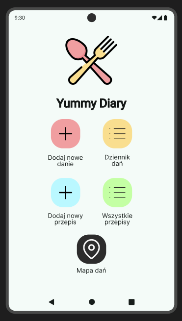
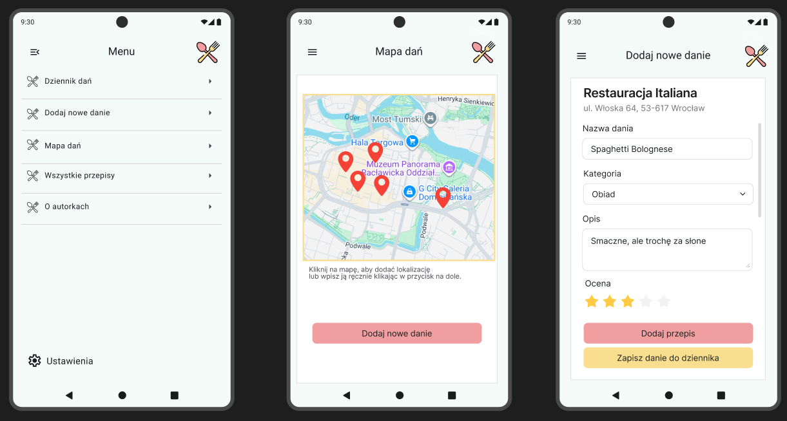
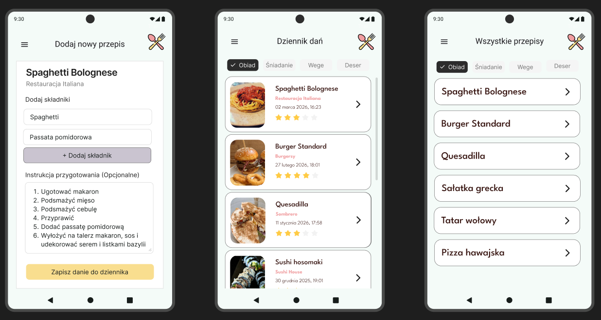
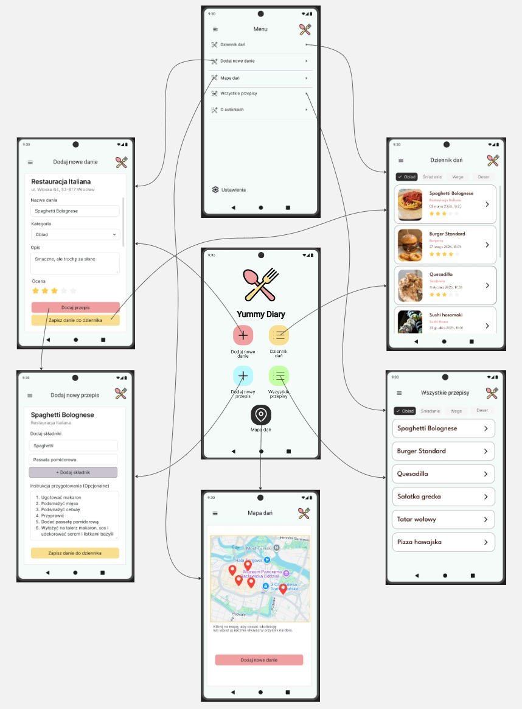
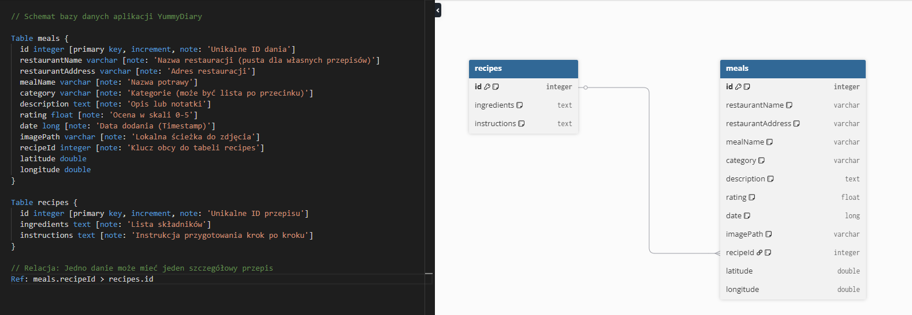

# YummyDiary - Twój Osobisty Dziennik Kulinarny

YummyDiary to aplikacja na system Android, która pozwala pasjonatom jedzenia dokumentować swoje kulinarne przygody – zarówno te w restauracjach, jak i domowe eksperymenty.

## Kluczowe Funkcje

-   **Dziennik Posiłków**: Zapisuj nazwy dań, opisy, oceny oraz dodawaj zdjęcia prosto z aparatu lub galerii.
-   **Integracja z Mapami**: 
    -   Wizualizacja Twoich kulinarnych odkryć na interaktywnej mapie (**osmdroid**).
    -   Śledzenie własnej lokalizacji w czasie rzeczywistym.
-   **Książka Przepisów**: Do każdego zapisanego dania możesz dodać własny przepis (składniki i instrukcje wykonania).
-   **Kategoryzacja**: Organizuj swoje wpisy za pomocą tagów (np. Obiad, Śniadanie, Deser) i łatwo je filtruj.
-   **Statystyki i Historia**: Przeglądaj historię swoich posiłków posortowaną chronologicznie.

## Technologia

-   **Język**: Kotlin
-   **Baza danych**: Room Database (SQLite) – lokalne przechowywanie danych i zdjęć.
-   **Mapy**: osmdroid + osmbonuspack (OpenStreetMap).
-   **Architektura**: MVVM (ViewModel, LiveData, Coroutines).
-   **UI**: Material Design 3.

## Widok Bazy Danych

Schemat bazy danych został zaprojektowany tak, aby umożliwić relacyjne powiązanie posiłków z ich przepisami:
-   `meals`: Przechowuje informacje o miejscu, ocenie i lokalizacji GPS.
-   `recipes`: Przechowuje szczegóły przygotowania dania.
