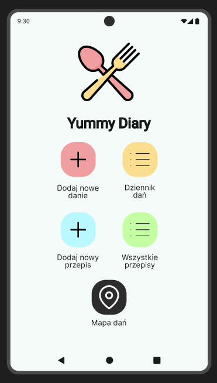
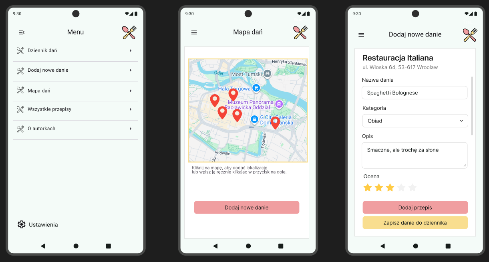
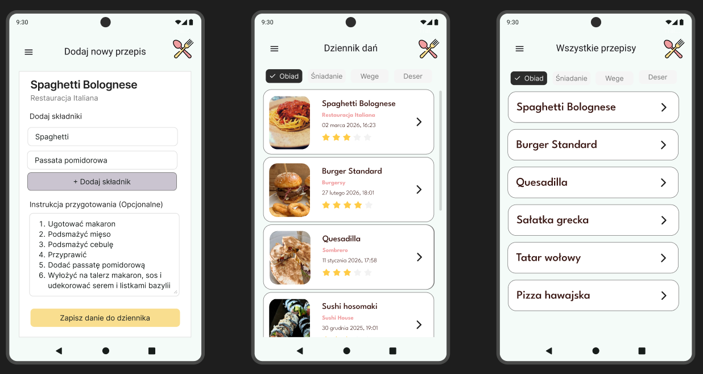
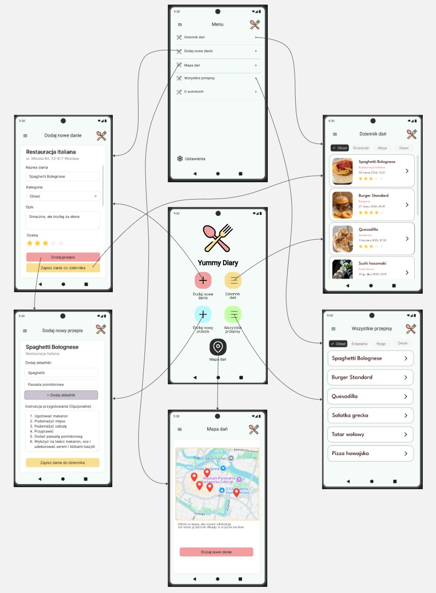
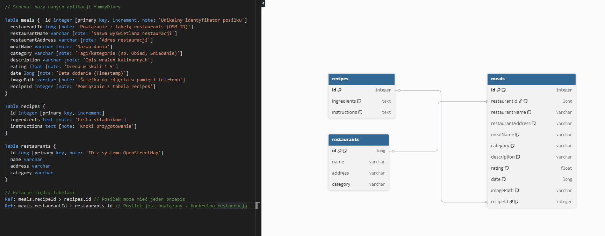

# YummyDiary - Twój Osobisty Dziennik Kulinarny

YummyDiary to aplikacja na system Android, która pozwala pasjonatom jedzenia dokumentować swoje kulinarne przygody – zarówno te w restauracjach, jak i domowe eksperymenty.

## Kluczowe Funkcje

-   **Dziennik Posiłków**: Zapisuj nazwy dań, opisy, oceny oraz dodawaj zdjęcia prosto z aparatu lub galerii.
-   **Integracja z Mapami**: 
    -   Wizualizacja Twoich kulinarnych odkryć na interaktywnej mapie (**osmdroid**).
    -   Śledzenie własnej lokalizacji w czasie rzeczywistym.
-   **Książka Przepisów**: Do każdego zapisanego dania możesz dodać własny przepis (składniki i instrukcje wykonania).
-   **Kategoryzacja**: Organizuj swoje wpisy za pomocą tagów (np. Obiad, Śniadanie, Deser) i łatwo je filtruj.
-   **Statystyki i Historia**: Przeglądaj historię swoich posiłków posortowaną chronologicznie.

## Technologia

-   **Język**: Kotlin
-   **Baza danych**: Room Database (SQLite) – lokalne przechowywanie danych i zdjęć.
-   **Mapy**: osmdroid (OpenStreetMap).
-   **Architektura**: MVVM (ViewModel, LiveData, Coroutines).
-   **UI**: Material Design 3.

### Projekt Ekranów
  

## Widok Bazy Danych

Schemat bazy danych został zaprojektowany tak, aby umożliwić relacyjne powiązanie posiłków z ich przepisami:
-   `meals`: Przechowuje informacje o miejscu, ocenie i lokalizacji GPS.
-   `recipes`: Przechowuje szczegóły przygotowania dania.
-   `restaurants`: Przechowuje dane o miejscach pobrane z OpenStreetMap (OMS)

## Szczegóły Techniczne

### Implementacja Mapy (osmdroid)
Wybrany został **osmdroid**, który pozwolił na stworzenie w pełni darmowego i elastycznego systemu geolokalizacji bez zależności od usług Google Play. Jest to biblioteka pozwalająca na wygodne korzystanie z danych OpenStreetMap.
- **Wyświetlanie danych**: Lokacje posiłków są pobierane z bazy Room (szerokość i długość geograficzna) i mapowane na obiekty `OverlayItem`.
- **Interakcja**: Użytkownik może kliknąć w marker na mapie, aby zobaczyć szczegóły danego posiłku (wykorzystanie `ItemizedOverlayWithFocus`).
- **Lokalizacja**: Aplikacja korzysta z `MyLocationNewOverlay`, aby śledzić pozycję użytkownika w czasie rzeczywistym i centrować na nim widok.
- **Płynność**: Kafelki mapy są renderowane asynchronicznie z wykorzystaniem wbudowanego systemu cache'owania, co minimalizuje zużycie danych komórkowych.

### Architektura ViewModel
Aplikacja została zbudowana zgodnie z zasadami **Clean Architecture** przy użyciu komponentów architekturalnych Android Jetpack.

- **Separacja logiki**: `ViewModel` służy jako jedyne źródło prawdy dla widoku (Activity/Fragment). Odpowiada za przygotowanie danych do wyświetlenia i obsługę zdarzeń użytkownika.
- **Reaktywność (LiveData/Flow)**: ViewModel udostępnia strumienie danych z bazy Room. Dzięki temu, gdy użytkownik doda nowy posiłek, lista w UI odświeża się automatycznie (bez przeładowywania ekranu).
- **Coroutines (Współbieżność)**: Wszystkie operacje na bazie danych (zapis/odczyt) oraz ładowanie zdjęć odbywają się w tle za pomocą `viewModelScope`. Zapobiega to "zamrażaniu" interfejsu użytkownika (ANR).
- **Warstwa Repository**: ViewModel nie komunikuje się bezpośrednio z bazą. Korzysta z warstwy repozytorium, która decyduje, czy dane mają pochodzić z lokalnej bazy danych, czy (w przyszłości) z API.

### Strumienie danych w ViewModel
1. `MealViewModel`
W tym modelu strumienie zarządzają danymi dotyczącymi zarejestrowanych posiłków i ich metadanych:
- meals (`StateFlow<List<Meal>>`): Główny strumień zawierający listę wszystkich zapisanych posiłków. Służy do wyświetlania dziennika i punktów na mapie.
- categories (`StateFlow<List<String>>`): Strumień unikalnych kategorii dań (np. "Obiad", "Deser"). Łączy kategorie domyślne z tymi dodanymi przez użytkownika.
- restaurants (`StateFlow<List<String>>`): Lista nazw restauracji pobrana z bazy, używana do podpowiedzi (autouzupełniania) przy dodawaniu nowego wpisu.
- selectedMeal (`StateFlow<Meal?>`): Przechowuje dane konkretnego posiłku, gdy użytkownik wejdzie w tryb edycji lub szczegółów.
2. `RecipeViewModel`
W tym modelu strumienie zarządzają danymi dotyczącymi zarejestrowanych przepisów i ich metadanych:
- recipes (`StateFlow<List<Recipe>>`): Strumień emitujący listę wszystkich zapisanych przepisów kulinarnych.
- recipeCategories (`StateFlow<List<String>>`): Kategorie specyficzne dla przepisów (np. "Wegetariańskie", "Szybkie").
- selectedRecipe (`StateFlow<Recipe?>`): Przechowuje aktualnie przeglądany lub edytowany przepis.

### Efekt końcowy

